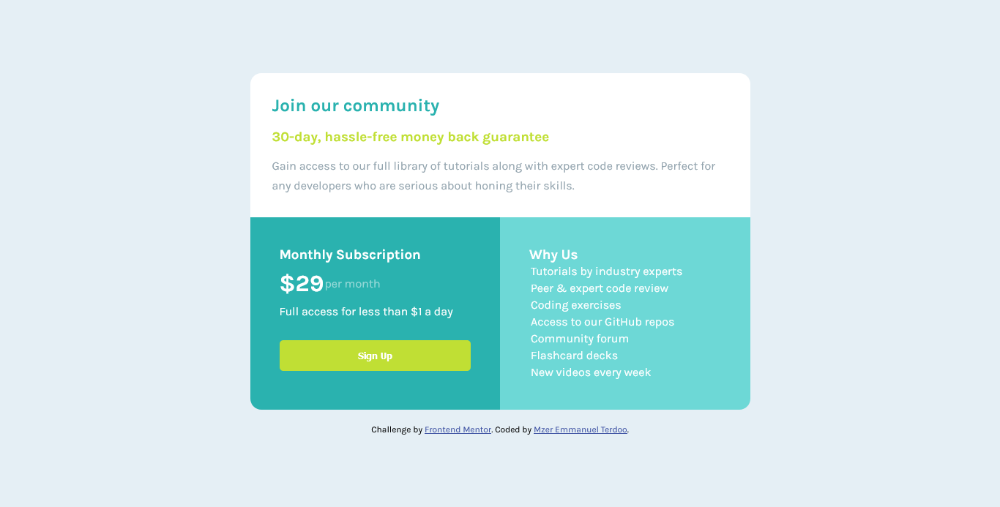

- [Overview](#overview)
  - [The challenge](#the-challenge)
  - [Screenshot](#screenshot)
  - [Links](#links)
- [My process](#my-process)
  - [Built with](#built-with)
  - [Continued development](#continued-development)
  - [Useful resources](#useful-resources)
- [Author](#author)

## Overview

### The challenge

- The project is responsive for both large and small devices.

### Screenshot

### Links

- Solution URL: [Add solution URL here](https://github.com/terdoo-mzer/Single-Price-Grid-Component-flexbox-grid)
- Live Site URL: [Add live site URL here]()

## My process

### Built with

- Semantic HTML5 markup
- CSS custom properties
- Flexbox
- CSS Grid

### Continued development

I plan to focus on developing my strengths in the use of CSS grid and flex.

### Useful resources

- [Resource 1](https://www.w3schools.com/css/css_grid.asp) - W3schools is a great resource!
- [Resource 2](https://www.w3schools.com/css/css3_flexbox.asp) -

## Author

- Frontend Mentor - [Terdoo-tech](https://www.frontendmentor.io/profile/Terdoo-tech)
